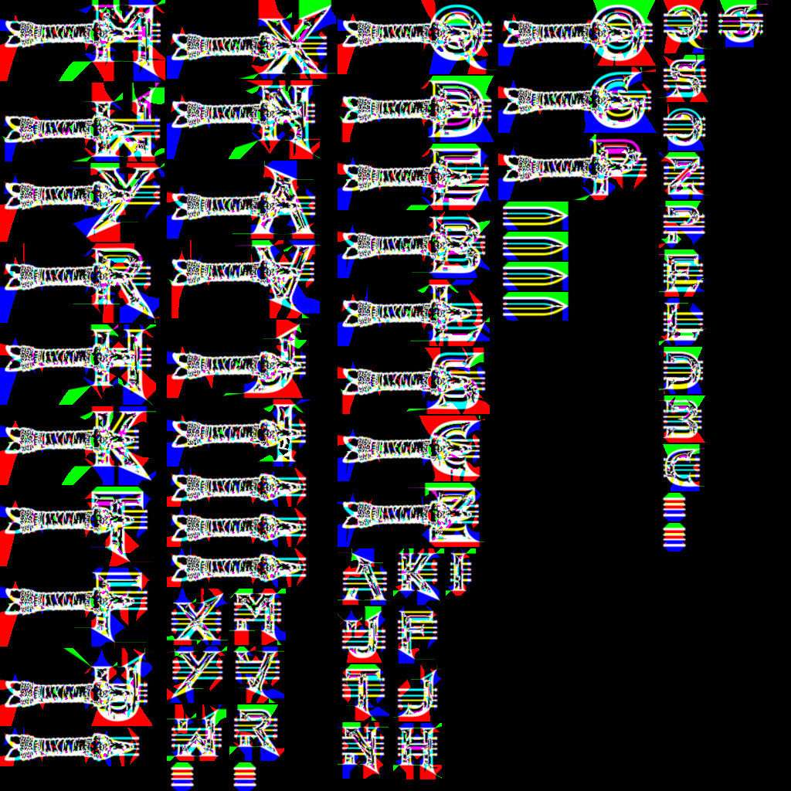
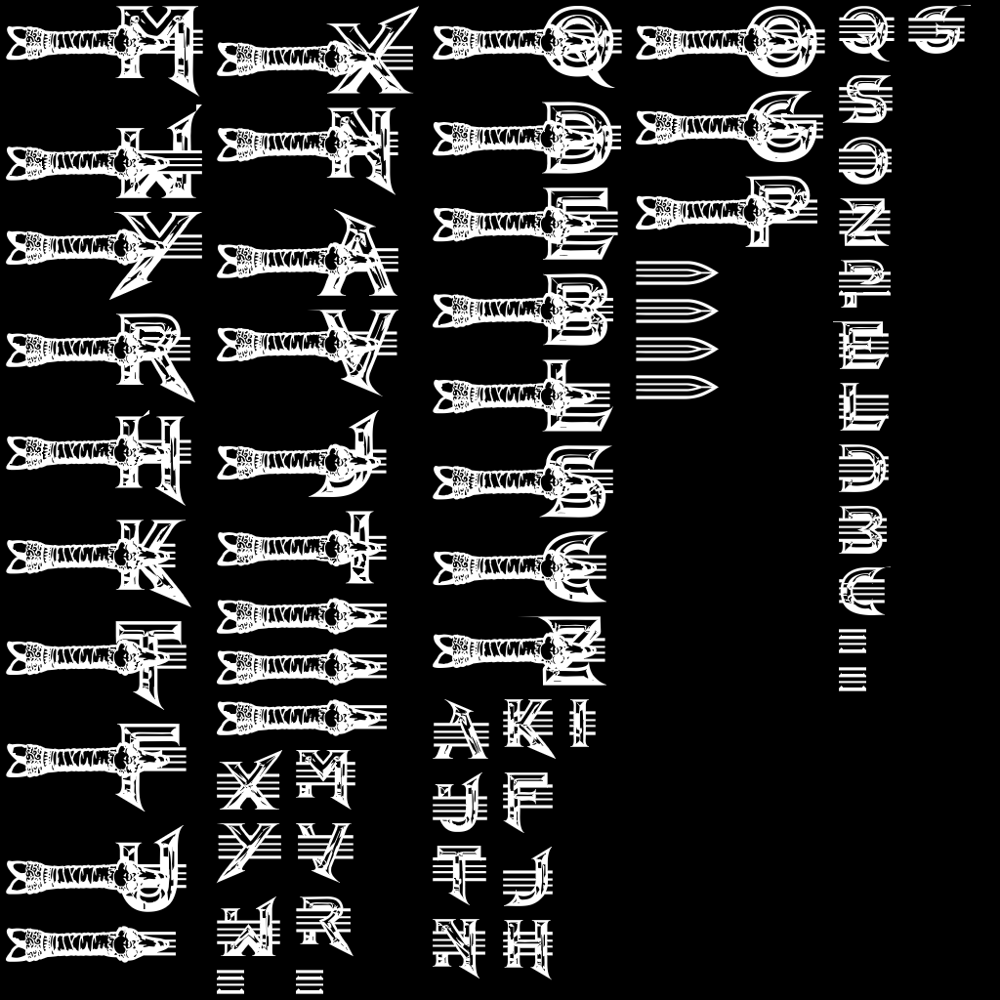

# MsdfAtlasGen.Cli

The primary tool for generating font atlases in Multi-channel Signed Distance Field (MSDF) formats. It combines glyph generation, packing, and metadata export into a single high-performance pipeline.

> [!TIP]
> **New to MSDF?** Check out our **[Advanced Technical Guide](file:///c:/Users/binos/Documents/Personal_project/MSDFGen-Sharp/MsdfAtlasGen.Cli/ADVANCED.md)** for deep dives into padding, error correction, and miter limits.

## 🚀 Quick Start


```bash
# Generate a 1024x1024 atlas for the Roboto font with BMFont outputs and a test render:

dotnet run -c Release -- -font "../assets/test_fonts/Roboto-Regular.ttf" -size 90 -dimensions 1024 1024 -fnt -testrender -spacing 2 -miterlimit 3.0 -coloringstrategy simple -errorcorrection indiscriminate

# Generate a 1024x1024 atlas for the RobotoFont with BMFont outputs, a test render and EASCII (more characters):

dotnet run -c Release -- -font "../assets/test_fonts/Roboto-Regular.ttf" -size 90 -dimensions 1024 1024 -fnt -testrender -spacing 2 -miterlimit 3.0 -coloringstrategy simple -errorcorrection indiscriminate -charset eascii

# Generate a 4092x4092 atlas for the Roboto font with BMFont outputs and a test render with allglyphs (may be big and hard to read at first glance.):

dotnet run -c Release -- -font "../assets/test_fonts/Roboto-Regular.ttf" -size 10 -dimensions 4092 4092 -fnt -testrender -spacing 2 -miterlimit 3.0 -coloringstrategy simple -errorcorrection indiscriminate -allglyphs 
```

---

## 🛠 Command Line Options

### 1. Input Controls
| Flag | Arguments | Description |
| :--- | :--- | :--- |
| `-font` | `<path>` | **Required.** Path to the TrueType or OpenType font file. |
| `-chars` | `<chars>` | Sets characters inline (e.g., `"ABCabc123"`). |
| `-charset` | `<charset.txt>` | Sets the character set file (or use 'ascii' / 'eascii'). |
| `-allglyphs` | *(None)* | Use all glyphs available in the font file. |
| `-fontscale` | `<value>` | Global scaling factor for all glyphs. |
| `-fontname` | `<name>` | Override the font name in the exported metadata. |

### 2. Atlas Type & Format
| Flag | Arguments | Description |
| :--- | :--- | :--- |
| `-type` | `msdf \| mtsdf \| sdf \| psdf \| softmask \| hardmask` | The rendering technique. **msdf** is recommended for most uses. |
| `-format` | `png \| bmp \| tiff \| binary \| text` | The internal storage format. (Default: **png**) |
| `-yorigin` | `bottom \| top` | Y-axis direction. **bottom** is standard for OpenGL, **top** for most UI engines. |

### 3. Dimensions & Packing
| Flag | Arguments | Description |
| :--- | :--- | :--- |
| `-dimensions` | `<w> <h>` | Sets fixed width and height for the atlas. |
| `-pots` | *(None)* | Force Power-of-Two Square (e.g., 512, 1024, 2048). |
| `-potr` | *(None)* | Force Power-of-Two Rectangle. |
| `-square` | *(None)* | Force any square dimension. |
| `-square4` | *(None)* | Force dimensions divisible by 4 (Default). |
| `-spacing` | `<px>` | Pixel gap between glyphs in the atlas (Default: 0). |

### 4. Distance Field Settings
| Flag | Arguments | Description |
| :--- | :--- | :--- |
| `-size` | `<px>` | The source EM size for glyph projection. Higher = more detail. |
| `-pxrange` | `<range>` | The width of the distance field gradient in pixels (Default: 2). |
| `-miterlimit` | `<value>` | Controls sharp corners. Use **2.0 - 4.0** for sharp fonts (Default: 1.0). |
| `-angle` | `<val>` | Corner detection threshold. Append `D` for degrees (e.g., `3.0` or `30D`). |
| `-coloringstrategy` | `simple \| inktrap \| distance` | How edges are colored for MSDF. **inktrap** is the default. |
| `-overlap` | *(None)* | **Enabled by default.** Supports complex self-intersecting glyphs. |
| `-nooverlap` | *(None)* | Disables overlap support (faster but riskier for complex fonts). |
| `-errorcorrection` | `auto \| indiscriminate \| disabled` | Artifact removal setting. Use **indiscriminate** for perfect results. |

### 5. Outputs
| Flag | Arguments | Description |
| :--- | :--- | :--- |
| `-fnt` | `[path]` | Generates `.fnt` (BMFont) and `.png` in the `output/Fnt/` folder. |
| `-json` | `[path]` | Generates metadata in JSON format in the `output/Json/` folder. |
| `-csv` | `[path]` | Generates layout metrics in CSV format. |
| `-imageout` | `[path]` | Explicit atlas image output. |
| `-testrender` | `[path]` | Generates a high-quality preview of the atlas in `output/Renders/`. |

### 6. Advanced Padding
| Flag | Arguments | Description |
| :--- | :--- | :--- |
| `-pxpadding` | `<val>` | Uniform inner padding in pixels. |
| `-apxpadding` | `<L B R T>` | Asymmetric inner padding in pixels. |
| `-outerpxpadding`| `<val>` | Uniform outer padding in pixels (Default: 2). |
| `-aouterpxpadding`| `<L B R T>`| Asymmetric outer padding in pixels. |
| `-empadding` | `<val>` | Uniform inner padding in EM units. |
| `-aempadding` | `<L B R T>` | Asymmetric inner padding in EM units. |

---

### 7. Misc Control
| Flag | Arguments | Description |
| :--- | :--- | :--- |
| `-threads` | `<N>` | Number of threads to use (0 = auto). |
| `-seed` | `<value>` | Random seed for edge coloring. |
| `-nokerning` | *(None)* | **Disables** kerning data in exported metadata. |
| `-nopreprocess` | *(None)* | Disables geometry preprocessing. |
| `-scanline` | *(None)* | **Enabled by default.** Uses scanline pass for robust filling. |

---

## 💡 Pro Tips

### Solving Rendering Artifacts
If you see "stray lines" or "scrambled corners":
1. Use **`-errorcorrection indiscriminate`**.
2. Increase **`-miterlimit 3.0`**.
3. Try **`-coloringstrategy simple`**.

### Performance
The tool is multi-threaded by default.
- Use **`-threads 0`** (Auto) to use all cores.
- Use **`-threads 1`** if you need to debug a specific crash.

### Custom Padding
Use `-aouterpxpadding <L> <B> <R> <T>` to add margins around glyphs for engines that require extra bleed.

---

## 📂 Output Directory Structure
The tool automatically organizes outputs:
- `output/Fnt/`: BMFont files and paired PNGs.
- `output/Json/`: Metadata and CSV files.
- `output/Renders/`: Visual verification images.
- `output/GlyphDump/`: (When using `-debugglyph`) Raw data for a specific character.

---

## 🎨 Visual Showcase

### Complex Font Example: Barbarian
Generating a high-detail atlas for a decorative font.

| MSDF Atlas | Rendered Result |
| :---: | :---: |
|  |  |
