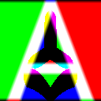

# Msdfgen.Cli

A diagnostic tool designed for high-precision generation of single-glyph Multi-channel Signed Distance Fields. This is ideal for testing specific characters, debugging font geometry, or generating high-resolution vector assets.

## 🚀 Basic Usage

Generate an MSDF for the letter 'A' with automatic framing and a test render:

```bash
dotnet run -c Release -- msdf -font "../assets/test_fonts/Roboto-Regular.ttf" 'A' -dimensions 128 128 -pxrange 4 -autoframe -testrender
```

| Raw MSDF Output | Rendered Result |
| :---: | :---: |
|  |  |
| *128x128 MSDF* | *Software Render* |

---

## 🛠 Command Line Options

### 1. Modes
The first argument must be the generation mode:
- `msdf`: Multi-channel Signed Distance Field (Recommended)
- `mtsdf`: Multi-channel and True Signed Distance Field
- `sdf`: Standard Signed Distance Field
- `psdf`: Pseudo-Distance Field

### 2. Input
| Flag | Arguments | Description |
| :--- | :--- | :--- |
| `-font` | `<font.ttf> <char>` | Load a specific glyph from a font file. Char can be `'A'`, `0x0041`, or `65`. |
| `-shapedesc` | `<file.txt>` | Load a shape description from a file. |
| `-defineshape` | `"<desc>"` | Define a shape directly in the command line using msdfgen syntax. |

### 3. Output & Dimensions
| Flag | Arguments | Description |
| :--- | :--- | :--- |
| `-o` | `<filename.png>` | Sets the output image filename. |
| `-dimensions` | `<w> <h>` | Sets the output image dimensions in pixels. |
| `-pxrange` | `<value>` | Sets the distance field range in pixels. |
| `-scale` | `<s>` | Manually set the glyph scale. |
| `-translate` | `<x> <y>` | Manually set the glyph translation. |
| `-autoframe` | *(None)* | Automatically centers and scales the glyph to fit the dimensions. |

### 4. Diagnostics & Verification
| Flag | Arguments | Description |
| :--- | :--- | :--- |
| `-testrender` | `[file] [w] [h]` | Performs a software render of the generated DF to verify quality. |
| `-angle` | `<val>` | Corner detection threshold (e.g., `3.0` or `30D`). |
| `-printmetrics` | *(None)* | Prints detailed glyph bounding box and advance metrics to console. |
| `-exportshape` | `<file.txt>` | Exports the interpreted vector shape to a text file. |

---

## 🔍 When to use this tool?
While `MsdfAtlasGen.Cli` is great for making font sheets, `Msdfgen.Cli` is better for:
1. **Debugging "Quirks"**: If a character looks wrong in an atlas, test it here in isolation.
2. **High-Res Assets**: Generating a 512x512 MSDF for a single logo or icon.
3. **Shape Testing**: Testing manual shape definitions without using a font file.
