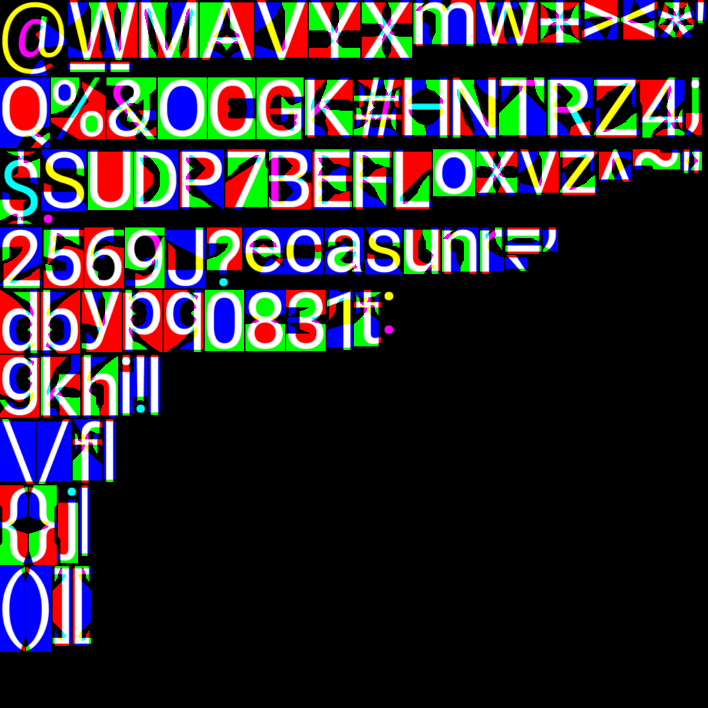
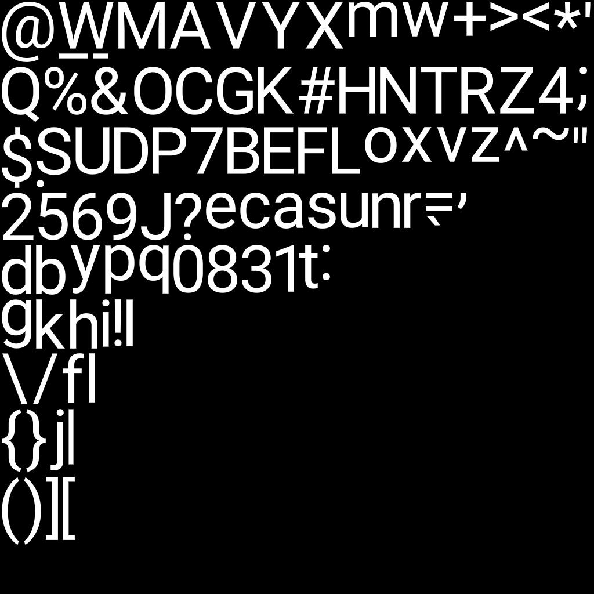

# MSDFGen-Sharp

| Raw MSDF | Rendered Glyph |
| :---: | :---: |
|  |  |
| *Original MSDF output* | *High-quality rendered result* |

A comprehensive C# port of the original [msdfgen](https://github.com/Chlumsky/msdfgen) and [msdf-atlas-gen](https://github.com/Chlumsky/msdf-atlas-gen) projects. This library provides high-quality Multi-channel Signed Distance Field (MSDF) generation for fonts and vector graphics, maintaining an almost 1:1 correspondence with the CLI and core functionality of Chlumsky's original implementation.

## 🏗 Project Architecture

The repository is organized into several components to separate core logic, extensions, and CLI tools:

### Core
- **[Msdfgen.Core](Msdfgen.Core/)**: The heart of the project. Contains the fundamental algorithms for MSDF generation, including math utilities, edge coloring, and shape processing.
- **[MsdfAtlasGen](MsdfAtlasGen/)**: Implements the logic for packing multiple glyphs into a single texture atlas and managing atlas metadata.
- **[Msdfgen.Extensions](Msdfgen.Extensions/)**: Provides integration with third-party libraries like FreeType and ImageSharp for font loading and image processing.
### CLI Tools
- **[MsdfAtlasGen.Cli](MsdfAtlasGen.Cli/README.md)**: The primary command-line tool for generating font atlases and exporting metadata (FNT, JSON, etc.).
- **[Msdfgen.Cli](Msdfgen.Cli/README.md)**: A diagnostic CLI tool for generating single-glyph MSDFs and testing core features.

> [!NOTE]
> **MSDFGen-Sharp is a port of the original msdfgen and msdf-atlas-gen projects. It is not a direct port of the original CLI tools.**
> **If you want to use the original CLI tools, you can find them here [MSDFGen](https://github.com/Chlumsky/msdfgen) and here [MSDFAtlasGen](https://github.com/Chlumsky/msdf-atlas-gen).**

## 📦 Installation

To use **MSDF-Sharp** in your project, install the package from NuGet:

```bash
dotnet add package MSDF-Sharp
```

Alternatively, you can find it on [NuGet.org](https://www.nuget.org/packages/MSDF-Sharp).

## ✨ Key Features

- **Multi-channel Signed Distance Fields (MSDF)**: Superior sharpness for text rendering at any scale.
- **Font Atlas Generation**: Efficiently pack multiple glyphs into a single texture.
- **Advanced Error Correction**: Integrated "Indiscriminate" and "Auto" modes to eliminate artifacts.
- **Overlap Support**: Properly handles complex glyphs with self-intersecting contours.
- **Multi-threaded**: Built-in support for parallel glyph generation.
- **Compatibility**: Generates standard BMFont (`.fnt`), `JSON`, and `CSV` metadata.

## 🛠 Building and Running

This project requires **.NET 9.0 SDK**. You can download it from [here](https://dotnet.microsoft.com/en-us/download/dotnet/9.0).

Refer to the [MsdfAtlasGen.Cli](MsdfAtlasGen.Cli/README.md) and [Msdfgen.Cli](Msdfgen.Cli/README.md) READMEs for more information on how to build and run the projects.

## 📄 License

This project is licensed under the MIT License. It utilizes several third-party libraries:

- **[Chlumsky msdfgen](https://github.com/Chlumsky/msdfgen)**: MIT License.
- **[Chlumsky msdf-atlas-gen](https://github.com/Chlumsky/msdf-atlas-gen)**: MIT License.
- **[FreeTypeSharp](https://github.com/ryancheung/FreeTypeSharp)**: MIT License.
- **[SixLabors ImageSharp](https://github.com/SixLabors/ImageSharp)**: Six Labors Split License.
    - *Note: For open-source projects or companies with <$1M USD annual gross revenue, this falls under the **Apache License, Version 2.0**.*

## 🎨 Showcase

### Font Atlases and Renders

Below are examples of generated MSDF atlases and how they appear when rendered.

| Font | MSDF Atlas | Rendered Showcase |
| :--- | :---: | :---: |
| **Roboto Regular** |  |  |
| **Barbarian** (Fantasy) |  |  |

